<div style="display: flex; justify-content: center;">
    
    
</div>

# News-App Mobile Kotlin

Version：1.0.3（Date：2024-03-11）

1. Clone the repository:

```bash
   git clone https://github.com/hoangtien2k3/news-app.git
```

## Introduction

Welcome to the news-app mobile of `news-app`. This Kotlin frontend is designed to handle the my
application.

## Project features ⚡ = 💗💎❤️

- ✅ Using `Mobile Kotlin MVVM` as a high level architecture
  This project brings to the table set of best practices, tools, and solutions:
    - 100% Kotlin
    - Kotlin Coroutines with Flow
    - Functional & Reactive programming with RxKotlin, RxJava3
    - Clean Architecture with MVI (Uni-directional data flow)
    - Modern architecture (Clean Architecture, Model-View-ViewModel)
    - Navigation, single-activity architecture with Jetpack Navigation
    - Initialize components at application startup with AndroidX Startup
    - Cache local data with Room Persistence Library
    - Schedule tasks with WorkManager
    - ViewModel, LiveData, Lifecycle, ... with Android Jetpack
    - Dependency injection Koin
    - Material Design Material Components for Android
    - Kotlin Gradle DSL
    - Gradle Kotlin DSL, Custom plugin

## Screenshots

|                         |                         |                         |                         |
|:-----------------------:|:-----------------------:|:-----------------------:|:-----------------------:|
| 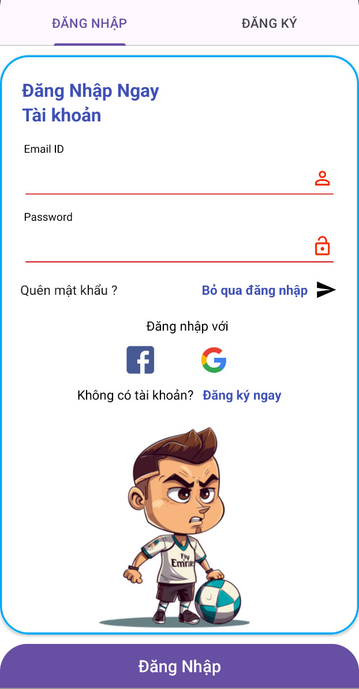  | 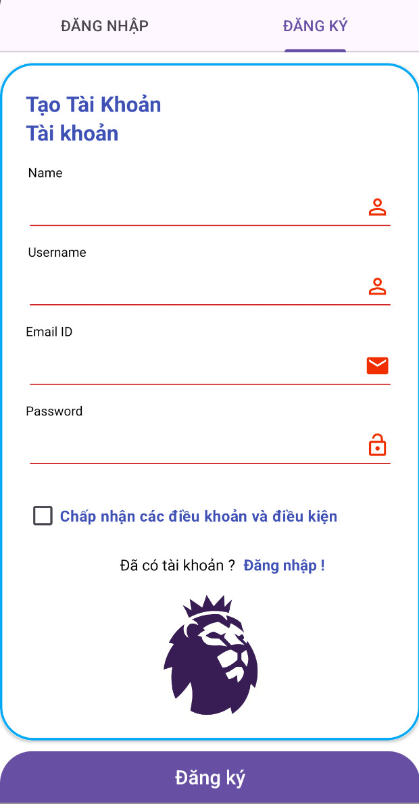  | 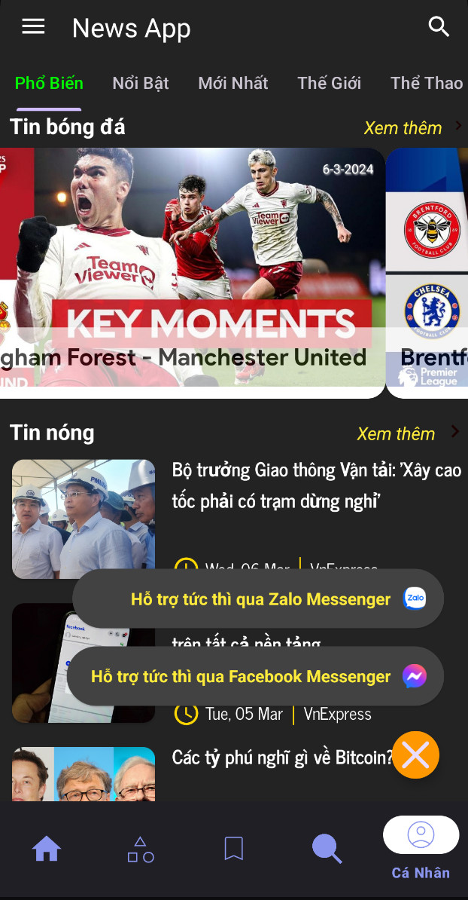  | 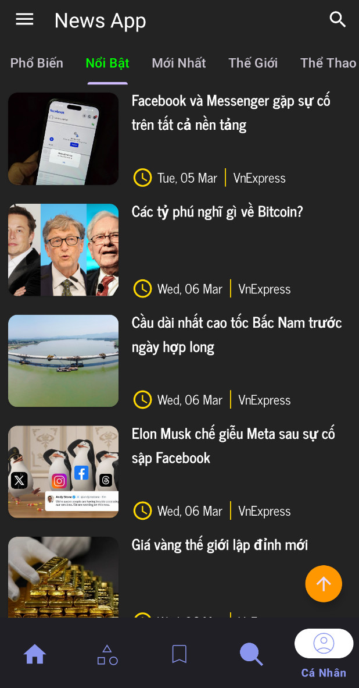  |
| 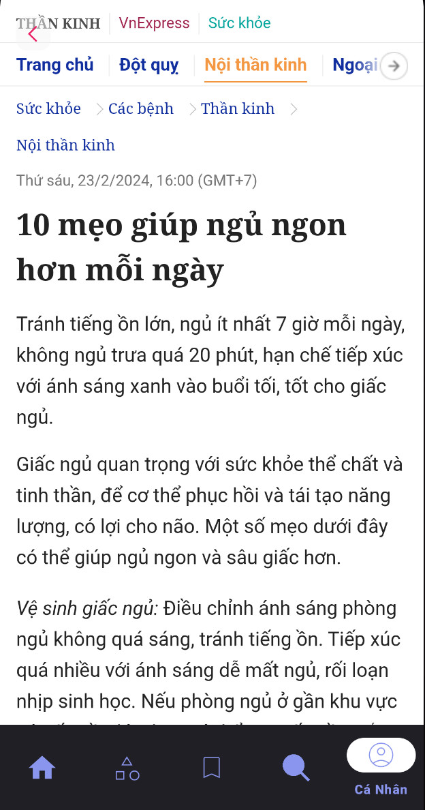  | 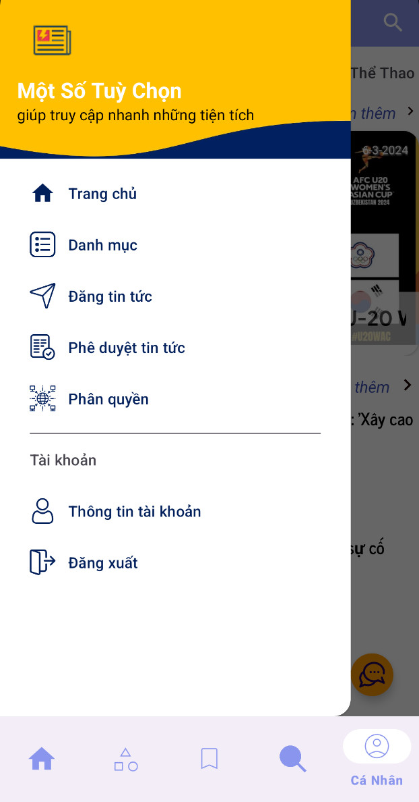  | 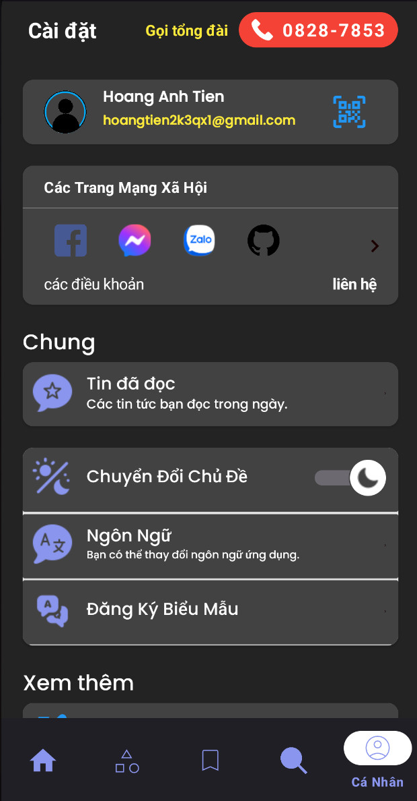  | 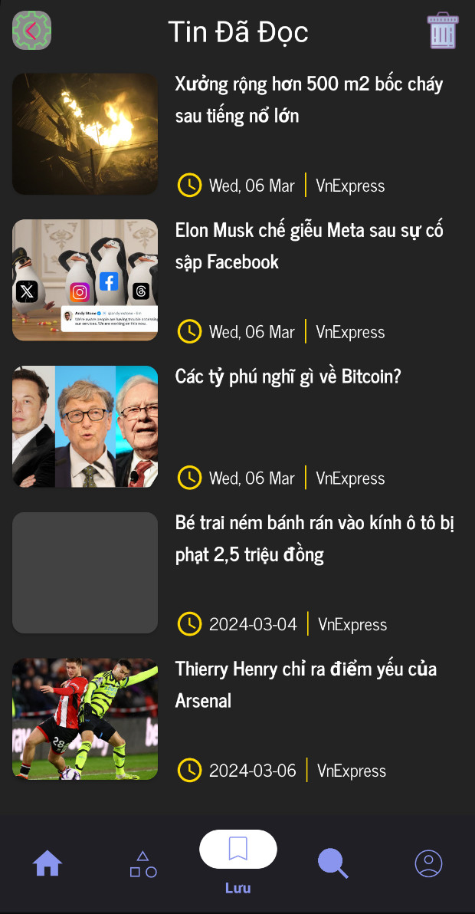  |
| 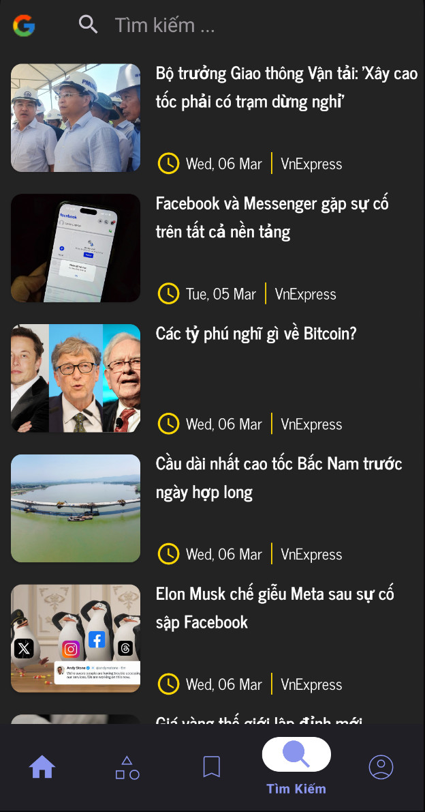  | 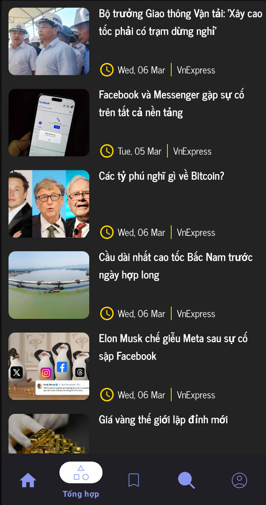 | 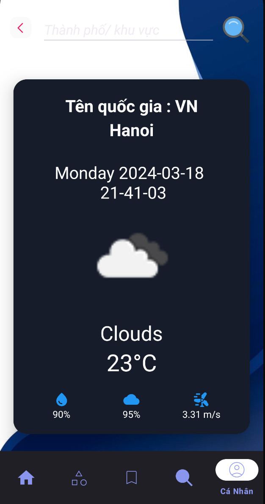 | 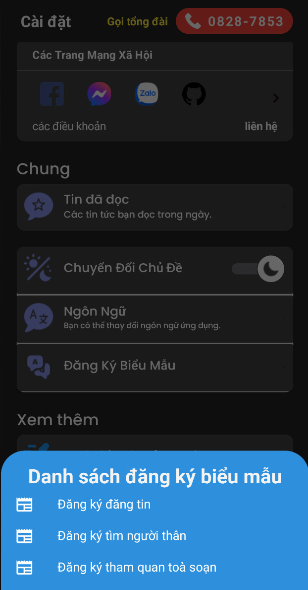 |
| 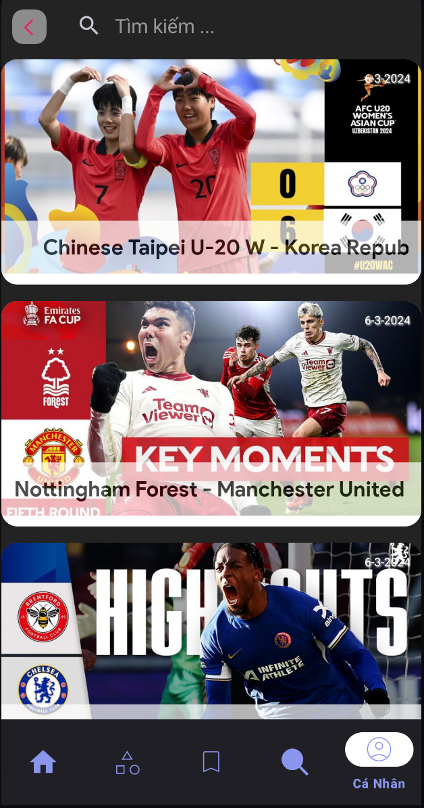 | 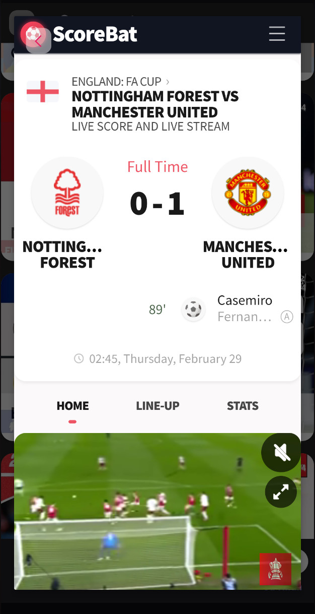 | 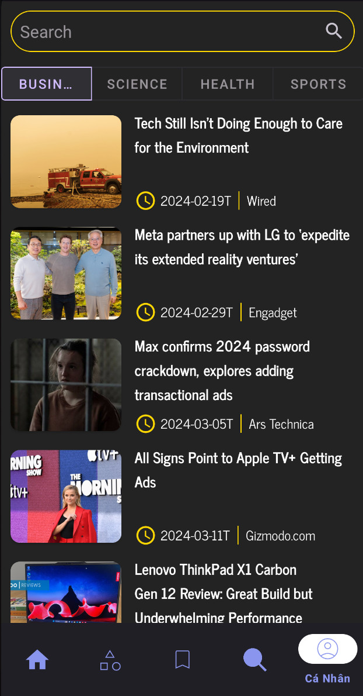 | 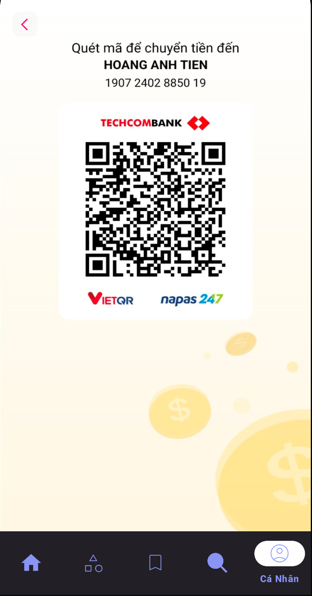 |

## The Complete Project Folder Structure

```text
app/
├── src/
│   ├── main/
│   │   ├── java/
│   │   │   ├── com.hoangtien2k3.news_app/
│   │   │   │   ├── data/
│   │   │   │   │   ├── model/              # Classes defining data
│   │   │   │   │   ├── repository/         # Classes accessing data
│   │   │   │   │   └── ...
│   │   │   │   ├── di/                     # Dependency Injection configuration
│   │   │   │   ├── ui/
│   │   │   │   │   ├── base/               # Base classes for UI components
│   │   │   │   │   ├── adapters/           # Adapters for RecyclerView or ListView
│   │   │   │   │   ├── fragments/          # Fragments in the app
│   │   │   │   │   └── viewmodels/         # ViewModels for MVVM architecture
│   │   │   │   └── util/                   # Useful utilities
│   │   ├── res/                            # Resources (layout, drawable, values, etc.)
│   └── test/                               # Directory containing tests
└── build.gradle                            # Gradle configuration file of the app
```

## Server Backend-API:

Clone this repository: https://github.com/hoangtien2k3/news-backend

## Contributing

If you would like to contribute to the development of this project, please follow our contribution
guidelines.

## License

This project is licensed under the [`MIT License`](LICENSE).

```text
MIT License
Copyright (c) 2024 Hoàng Anh Tiến
```

## Contributors ✨

<!-- ALL-CONTRIBUTORS-LIST:START - Do not remove or modify this section -->
<!-- prettier-ignore-start -->
<!-- markdownlint-disable -->
<table>
  <tr>
    <td align="center"><a href="https://www.linkedin.com/in/hoangtien2k3/"><br /><sub><b>Hoàng Anh Tiến</b></sub></a><br /><a href="https://github.com/hoangtien2k3/news-app/commits?author=hoc081098" title="Code">💻</a> <a href="#maintenance-hoangtien2k3" title="Maintenance">🚧</a> <a href="#ideas-hoangtien2k3" title="Ideas, Planning, & Feedback">🤔</a> <a href="#design-hoangtien2k3" title="Design">🎨</a> <a href="https://github.com/hoangtien2k3/news-app/issues?q=author%hoangtien2k3" title="Bug reports">🐛</a></td>
  </tr>
</table>

<!-- markdownlint-restore -->
<!-- prettier-ignore-end -->

<!-- ALL-CONTRIBUTORS-LIST:END -->

